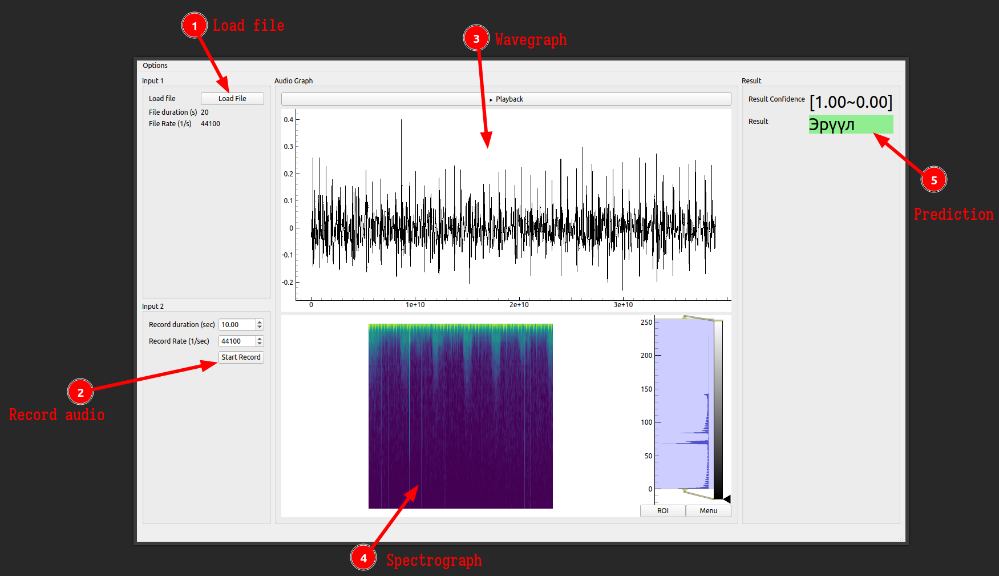
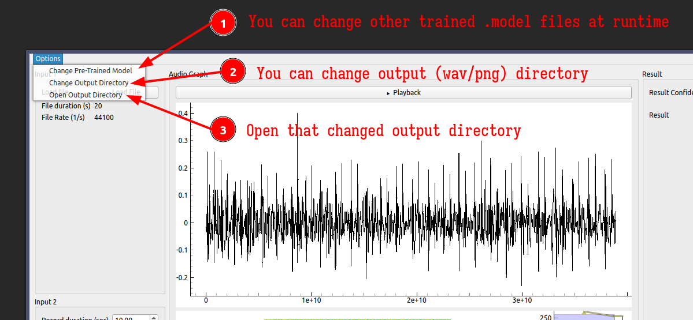

# CNN based Influenza Classifier via Digital Stethoscope

# Usage:

## Running
- `python main.py` (or `make run`)

# Change:

## Changing the UI
1. Change `UI/UI_Mainwindow.ui` via `pyside6-designer` (or similar `qt-designer` software)
2. `make conver_all` to convert `UI/UI_Mainwindow.ui` to `Custom_UIs/UI_Mainwindow.py` (this requires `find` in your cli, may not work on _windows_)

## Changing the Back-end functionalities
1. Change `Custom_Widgets/Lib_Mainwindow.py`

## Creating binary release
- `pyinstaller -F main.py` (or `make release`)
- probably won't work, due to loading at the begining "best_checkpoint_2_class_masked_5_17.model".
  (if we load it manually (eg. user manually clicking to load), then use to create EXE or APPIMAGE)

